# Shopify Horizon Customizations — Portfolio

**Five production-style storefront features built on Shopify's Horizon theme (Online Store 2.0)** —
written in Liquid, vanilla JavaScript (ES modules) and CSS, with no apps and no external libraries.

By **Yasir Majeed** · Shopify developer

| Demo | What it shows | Live URL* |
| --- | --- | --- |
| [Advanced AJAX Cart](#1-advanced-ajax-cart--smart-upsells) | Cart drawer, free-shipping and gift progress, smart upsells, bought together, discount codes | `/pages/advanced-cart` |
| [Shop the Look](#2-shop-the-look) | Lifestyle images with product hotspots, variant-aware quick add, add the whole look | `/pages/shop-the-look` |
| [Product Personalizer](#3-product-personalizer) | Live SVG product preview, variant logic, add-on products, validation | `/pages/custom-gift-box` |
| [Build Your Own Box — Chocolate](#4-build-your-own-box--four-step-chocolate-builder) | Four-step builder, state persistence, filters, honest pricing | `/pages/build-your-own-box-2` |
| [Build Your Own Box — Classic](#5-build-your-own-box--single-page-builder) | Single-page bundle builder with min/max rules | `/products/build-your-own-box` |

\* Store: `yasir-demo-lab.myshopify.com` — a password-protected development store. The password is
available on request.

---

## Contents

- [Tech stack](#tech-stack)
- [1. Advanced AJAX Cart & smart upsells](#1-advanced-ajax-cart--smart-upsells)
- [2. Shop the Look](#2-shop-the-look)
- [3. Product Personalizer](#3-product-personalizer)
- [4. Build Your Own Box — four-step chocolate builder](#4-build-your-own-box--four-step-chocolate-builder)
- [5. Build Your Own Box — single-page builder](#5-build-your-own-box--single-page-builder)
- [Engineering decisions](#engineering-decisions)
- [Project structure](#project-structure)
- [Running it yourself](#running-it-yourself)
- [Testing](#testing)
- [Limitations and next steps](#limitations-and-next-steps)
- [Credits](#credits)

---

## Tech stack

- **Shopify Online Store 2.0** — JSON templates, sections with blocks and settings, snippets with `` contracts
- **Liquid** — server-rendered markup, variant and product data serialized to JSON for the client
- **JavaScript** — native ES modules on Horizon's `Component` base class (`@theme/component`), import-map entries, no build step
- **Shopify AJAX Cart API** — `/cart/add.js` with multi-item payloads and line-item properties
- **Horizon cart events** — `CartLinesUpdateEvent` / `CartErrorEvent` so the cart drawer and cart count stay in sync
- **CSS** — scoped `` per component, custom properties, logical properties, `:has()`, `color-mix()`, reduced-motion support
- **Tooling** — Shopify CLI (theme pull/push), Theme Check, Git

---

## 1. Advanced AJAX Cart & smart upsells

A coffee shop ("Brew Bar") built to show a complete AJAX cart experience. Every number in the drawer comes
from Shopify's cart JSON — nothing is simulated in the browser.

<p>
  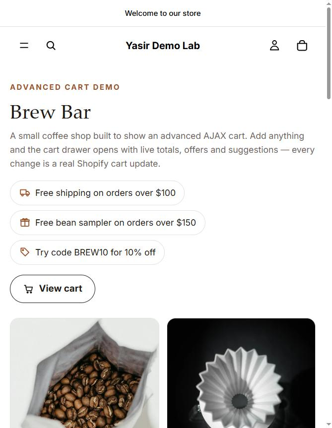
  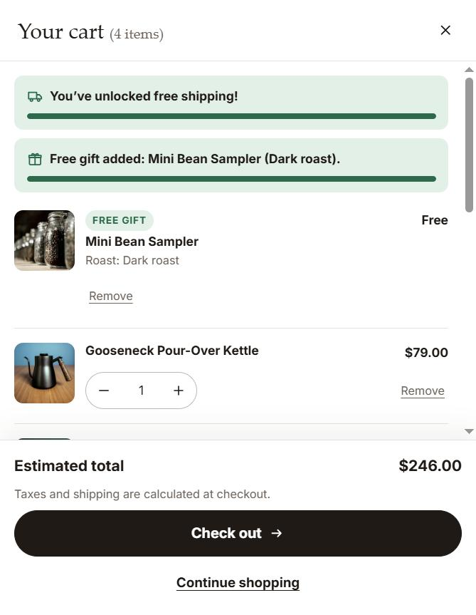
</p>
<p>
  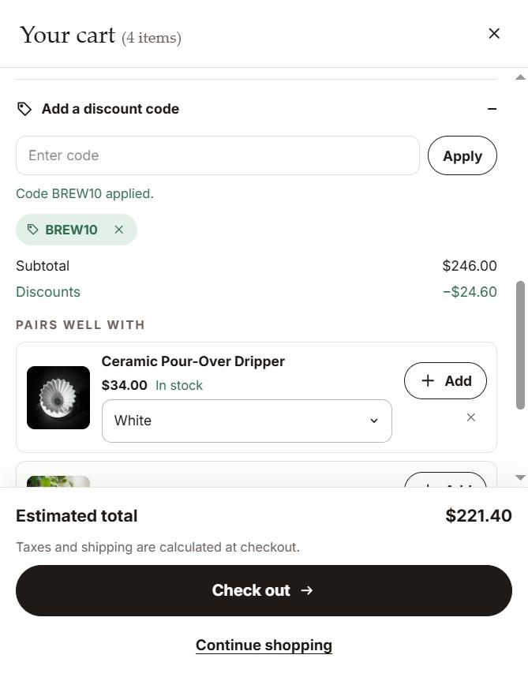
  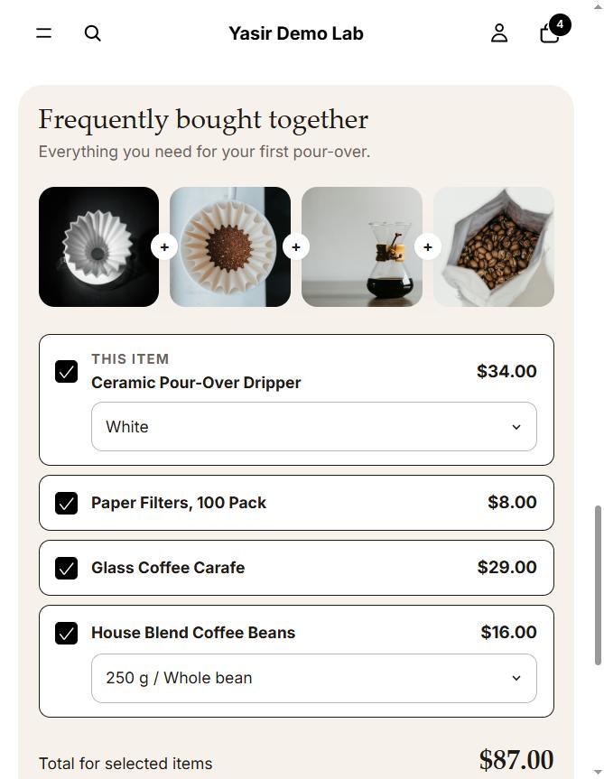
</p>

**Features**
- **Cart drawer** — native modal `<dialog>` that slides in after add to cart or from the header cart button.
  Line items show image, title, selected options, visible line-item properties, line discounts and price.
- **Quantity and remove** — rapid +/− clicks are coalesced into one `/cart/change.js` request; lines are
  addressed by their line key, so BYOB contents and personalization properties are preserved. Stock limits
  are reported from Shopify's response ("Only 5 items were added…").
- **One request at a time** — every cart mutation goes through a single queue, so requests never race;
  buttons show loading states and repeat clicks are ignored while a request is in flight.
- **Free-shipping progress** — threshold set in the theme editor (store currency, converted for other
  currencies). The bar only shows when the merchant confirms a matching Shopify free-shipping offer exists;
  in the demo store it is backed by an automatic free-shipping discount.
- **Free gift** — a $0 gift variant unlocks above $150. The shopper chooses the gift (it is never added
  silently); the drawer keeps exactly one gift, at quantity 1, and removes it if the cart drops below the
  threshold. The gift the shopper chose wins over copies added any other way.
- **Smart upsells** — merchant rules ("when the cart contains X, suggest Y"), then Shopify's Product
  Recommendations API (optionally limited to a tag), then a fallback list. Products already in the cart,
  sold-out products and dismissed suggestions are skipped; the list re-ranks after every cart change.
- **Frequently bought together** — checkboxes, variant pickers and a live combined price; the selection is
  added in one `/cart/add.js` request with a per-item fallback that names anything Shopify rejects.
- **Discount codes** — applied through `/cart/update.js`; the drawer only reports success when Shopify marks
  the code as applicable, and removes rejected codes again.
- **Empty cart** — message, continue-shopping actions and featured products with quick add.
- **One cart system** — on this page the header cart button opens this drawer and Horizon's drawer auto-open
  is paused; every mutation also dispatches Horizon's standard cart events, so the header count and the
  theme's own cart stay in sync everywhere.

**Accessibility** — focus moves into the drawer and back to the opener, Escape and backdrop close, focus is
kept on a sensible element after a line or suggestion disappears, one polite live region announces changes,
and every icon button has a descriptive name.

---

## 2. Shop the Look

Four shoppable room scenes. Each hotspot opens a product card; every product in the look can be added
individually or all at once.

<p>
  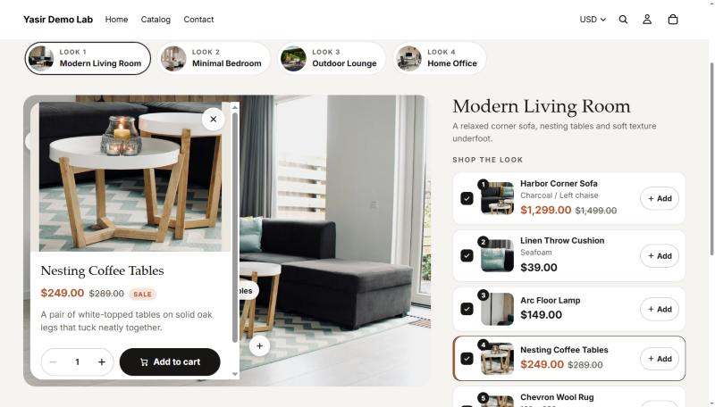
</p>
<p>
  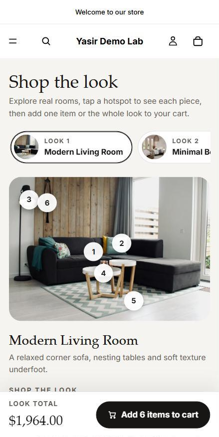
  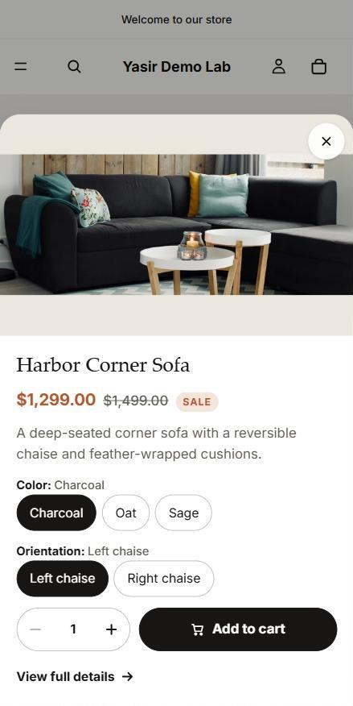
</p>

**Theme editor structure**
```
Shop the Look section        heading, intro, "show Add all"
└─ Look (theme block)        title, description, image, image alt
   └─ Hotspot (theme block)  product, X %, Y %, label
```
Merchants add looks and hotspots like any other block, with no code involved. Positions are percentages, so hotspots stay
on their object at every screen size.

**Features**
- **Look switcher**: a tablist with thumbnails, arrow, Home and End keys, built from the look blocks.
- **Hotspots**: pulsing markers, numbered on mobile, labelled on desktop; each is a real `<button>` with
  `aria-expanded`.
- **Product card**: image, sale and compare-at price, rating (from the `reviews.rating` metafield when it
  exists; never faked), description, variant pills that mark sold-out combinations, quantity and Add to cart.
  It is a popover beside the hotspot on desktop and a modal bottom sheet on mobile, using a native `<dialog>`
  with Esc to close and focus returned to the opener.
- **Synced product list**: selecting a hotspot highlights its list row and vice versa; variant and quantity
  changes appear in both places; each row has View and Add.
- **Add all to cart**: one request for every checked, available item, using its chosen variant and quantity.
  Sold-out items are skipped and named in the result ("Added 3 items to your cart. Not added: Concrete Cube
  Side Table").
- **Look total** that updates with variant, quantity and include/exclude changes.

**How the cart works**
All items go to `/cart/add.js` in a single `items` request. If that fails (for example one item ran out of
stock in the meantime), each item is retried on its own, so the available ones still get added and the
failures are reported. Horizon's `CartLinesUpdateEvent` then refreshes the cart drawer and cart count.

---

## 3. Product Personalizer

A customer designs a gift box and sees it update instantly.

<p>
  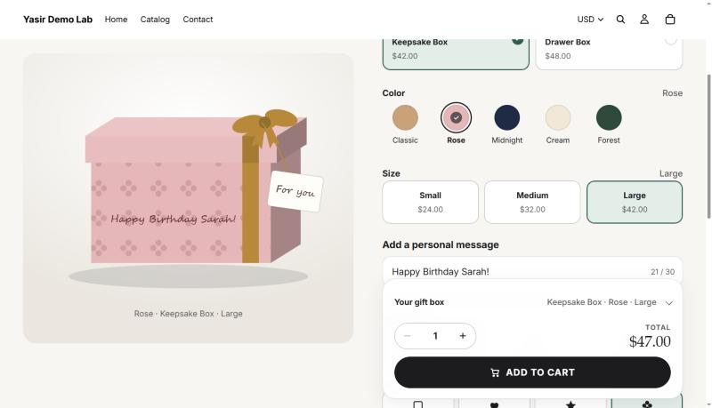
  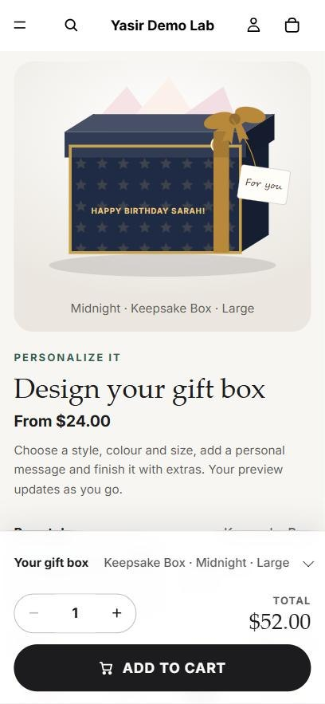
</p>

**Features**
- **Box style, color and size** as real Shopify variants (2 × 5 × 3 = 30). Color swatches show a tick and a bold label, so selection is never communicated by color alone.
- **Personal message** with a live counter, character limit and an unsupported-character check (emoji are rejected because they can't be printed). The text appears on the box lid as you type and auto-shrinks to fit.
- **Lettering** (script, serif, modern) and **design motifs** (hearts, stars, floral).
- **Add-ons** — Premium Ribbon, Gift Card, Premium Packaging — that also appear in the preview.
- **Quantity** stepper with min/max guards; invalid input is explained, never silently changed.
- **Live price breakdown**: box + add-ons = per box × quantity = total.
- **Validation summary** on Add to cart; each error links to its field.
- Design is **saved in localStorage** and restored after a refresh.

**How the cart works**
One `/cart/add.js` request adds the box variant plus one line per add-on, all at the same quantity.
The box line stores `Personal message`, `Lettering`, `Design` and `Add-ons` as line-item properties; add-on
lines store `Added to: Custom Gift Box (Rose / Large)`; every line shares a hidden `_pz_bundle` ID.

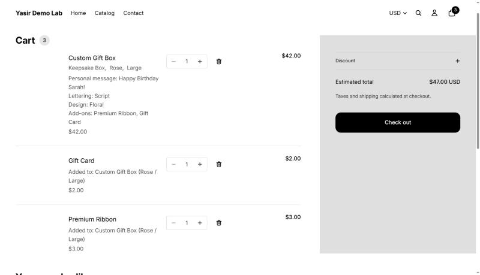

---

## 4. Build Your Own Box — four-step chocolate builder

Choose a box → choose flavors → choose a sleeve → review → add to cart.

<p>
  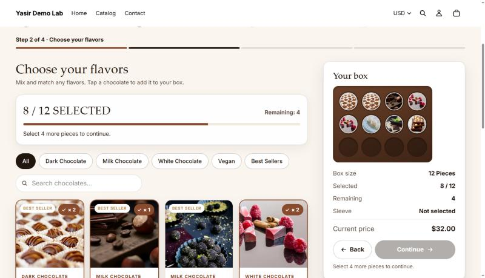
  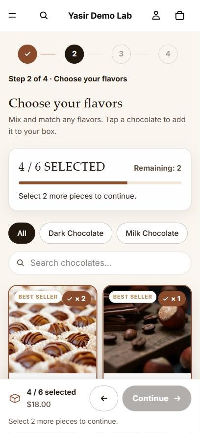
</p>

**Features**
- Four-step flow with a desktop step bar and compact mobile markers; completed steps are clickable.
- Box sizes 6 / 12 / 16 / 24 with a visual layout of the pieces.
- Flavor grid with **category filters** and **search** that never touch the selection.
- "8 / 16 selected" counter, remaining count, capacity guard with a friendly message.
- **Box tray preview** — one slot per piece, showing the flavor photo; click a piece to remove it.
- Sleeve step with surcharges shown relative to the chosen size ("Included", "+$4.00").
- Review step with Edit buttons that jump back without losing anything.
- State **persisted to localStorage**, validated against the catalog on reload, with a "Start over" option.

**How the cart works**
The box product has two options — *Box size* × *Sleeve* (16 variants) — and each variant's price is the full box
price. The builder adds that variant, so the displayed price is exactly what Shopify charges. Flavors are
stored as line-item properties (`Total pieces`, `Flavor 1: Dark Sea Salt Caramel × 3`, …) plus a hidden
`_yb2_config` JSON with product IDs for fulfilment.

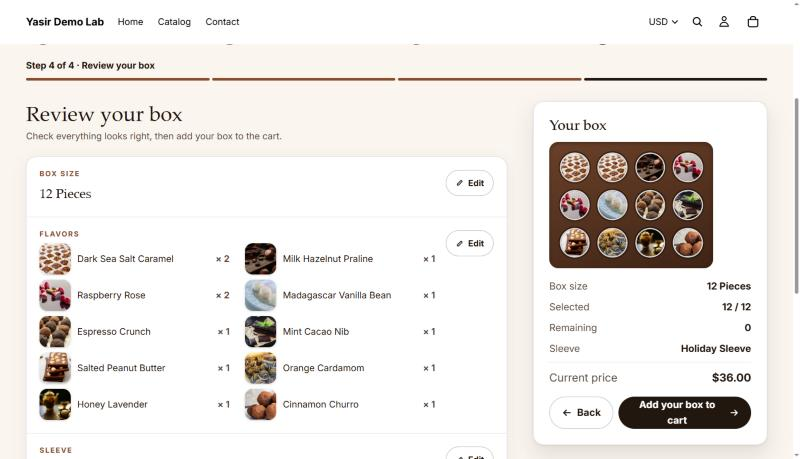

---

## 5. Build Your Own Box — single-page builder

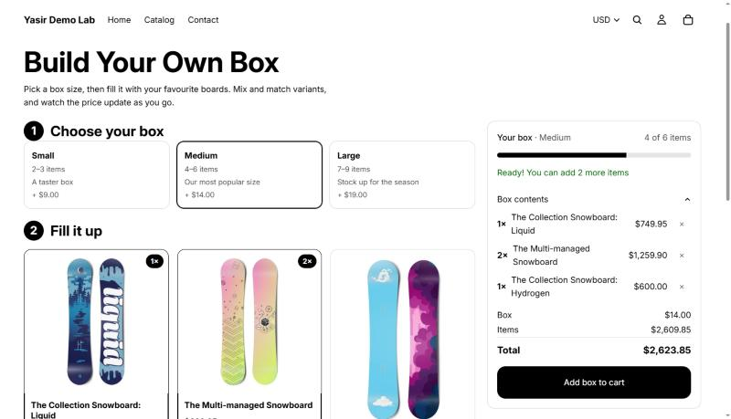

- Box sizes as product variants; per-size minimum and maximum item counts configured in theme-editor blocks.
- Product cards with variant selects and quantity steppers that respect tracked inventory.
- Live progress bar, status message and price (box fee + items).
- Add to cart is disabled until the selection is valid; one request adds the box and every item, linked by a shared `_byob_id`.

---

## Engineering decisions

**Honest pricing.** A theme cannot change a product's price, so every demo models price with real data: variants
(box size × sleeve, style × color × size) and add-on products added as linked cart lines. The number shown on
the page is always the number in the cart — no front-end-only prices.

**Isolation.** Each feature has its own namespace (`byob-`, `yb2-`, `pz-`, `stl-`, `acx-`) across sections, snippets, CSS classes,
custom elements, data attributes, localStorage keys and locale keys. Shared theme files are only touched
additively (import-map entries in `snippets/scripts.liquid`, new namespaces in `locales/en.default*.json`).

**Modular JavaScript.** Logic is split into small modules — a pure *model* (pricing, validation, cart payload),
a *view* or *preview* renderer, a *cart* module and a thin *controller* component — loaded through Horizon's
import map, with no bundler.

**Theme-native integration.** Components extend Horizon's `Component` class and use its `ref` / `on:` attribute
conventions; cart updates dispatch Horizon's standard events so the drawer, cart count and cart page refresh
like the theme's own add-to-cart.

**Merchant-editable.** Products, collections, sizes, sleeves, swatch colors, limits and copy are section/block
settings, editable in the theme editor without code. All storefront text lives in locale files.

**Accessibility.** Native radio, checkbox and button controls; visible focus states; labelled steppers; one polite
live region per feature; focus moves to the new step heading or to the error summary; touch targets of at
least 44px; reduced-motion support.

**Performance.** No dependencies; lazy-loaded responsive images; DOM updates only where state changed;
debounced search; requests aborted when components disconnect.

---

## Project structure

```
assets/
  acx-cart-api.js acx-offers.js acx-ui.js acx-cart-drawer.js acx-products.js   # Advanced cart
  stl-model.js stl-card.js   stl-cart.js stl-looks.js           # Shop the Look
  pz-model.js  pz-preview.js  pz-cart.js  pz-customizer.js     # Product Personalizer
  yb2-model.js yb2-store.js   yb2-view.js yb2-cart.js yb2-builder.js   # BYOB 2
  byob-builder.js                                              # BYOB 1
sections/
  acx-cart-drawer.liquid  acx-products.liquid  acx-fbt.liquid
  stl-shop-the-look.liquid
  pz-customizer.liquid  yb2-builder.liquid  byob-builder.liquid
blocks/
  _stl-look.liquid  _stl-hotspot.liquid                         # nested theme blocks
snippets/
  acx-*.liquid  stl-*.liquid  pz-*.liquid  yb2-*.liquid  byob-*.liquid
templates/
  page.acx.json  page.stl.json  page.pz.json  page.yb2.json  product.byob.json
data/
  acx-products.csv  make-acx-data.js  add-acx-locales.js
  stl-products.csv  make-stl-data.js  add-stl-locales.js
  pz-products.csv  yb2-products.csv  make-pz-products.js  add-pz-locales.js
docs/screenshots/                                              # images in this README
```

Everything else is the stock Horizon 4.2.0 theme (first commit), kept so the repo is a complete, pushable theme.

---

## Running it yourself

1. **Push the theme** with Shopify CLI:
   ```bash
   shopify theme push --store <your-store>.myshopify.com --unpublished
   ```
2. **Import the demo products** from *Products → Import*:
   `data/yb2-products.csv` (chocolate box + 12 flavors), `data/pz-products.csv` (gift box + 3 add-ons) and
   `data/stl-products.csv` (21 furniture and decor products) and `data/acx-products.csv` (11 coffee products,
   including a $0 gift). For the advanced cart, also create an automatic free-shipping discount and a test code. For Shop the Look, upload the four scene images to
   *Content → Files* as `stl-look-living.jpg`, `stl-look-bedroom.jpg`, `stl-look-outdoor.jpg` and `stl-look-office.jpg`.
3. **Create the pages** and assign their templates: `acx` → `/pages/advanced-cart`, `stl` → `/pages/shop-the-look`, `pz` → `/pages/custom-gift-box`, `yb2` →
   `/pages/build-your-own-box-2`. For BYOB 1, set a box product's theme template to `byob`.
4. Adjust products, limits and copy in the theme editor.

`data/` and `docs/` are listed in `.shopifyignore`, so theme pushes skip them.

---

## Testing

Each feature was tested end to end on the live development store, on desktop and at 375px mobile width:
option changes, validation edge cases (empty, over-limit, invalid characters, invalid quantities), capacity rules,
filters and search, refresh persistence, add to cart, cart line properties, cart-page display and console errors.
In every case the price shown on the page matched the cart total. Theme Check reports no offenses in the
added files.

---

## Limitations and next steps

- Bundle lines (box items, add-ons) can be edited individually in the cart. A **Cart Transform** Shopify Function
  would merge them into a single bundle line; **Cart and Checkout Validation** could enforce the rules server-side.
- Flavor inventory isn't decremented in BYOB 2 because flavors are stored as properties.
- The personalizer preview is an illustration, not a print proof.
- The free gift and upsell rules run in the theme. A **Cart Transform** or **Cart and Checkout Validation**
  Function would enforce the gift rule server-side (a $0 product can otherwise be added directly).
- Shopify's related-product recommendations need purchase and catalog data; on a new store the merchant
  rules and fallback list carry the upsells.
- Shop the Look hotspot positions are set as numbers; a visual drag-to-place picker would need an app or
  theme-editor extension.
- Only English strings are included; other locales fall back to English.

---

## Credits

- Base theme: **Horizon** by Shopify (first commit is the unmodified theme). All feature code listed above was
  written for this portfolio.
- Chocolate and sleeve photos: free images from [Unsplash](https://unsplash.com/license) by Rosemary Williams,
  Ilya Mashkov, Massimo Adami, Jana Ohajdova, Monika Grabkowska, amirali mirhashemian, Ediglecio Lêla,
  Tetiana Bykovets, Büşra Salkım, Ioana Enescu, Hannah Dodwell, Elena Leya, Wijdan Mq, Ekaterina Shevchenko,
  Anastasiia Chepinska and Shamblen Studios.
- Brew Bar product photos: free images from [Unsplash](https://unsplash.com/license) by Nadia Valko,
  syahmi syahir, Madeline Liu, Devin Avery, Zarak Khan, Charlie Firth, Ashkan Forouzani, User_Pascal,
  Samantha Ram, Taylor Beach, An Nguyen and Clint Bustrillos.
- Shop the Look scenes: free images from [Unsplash](https://unsplash.com/license) by Sven Brandsma,
  Collov Home Design, Sergej and Arthur Lambillotte; product photos are crops of those scenes.
- Gift box preview, truffle and sleeve illustrations: original SVG artwork.
